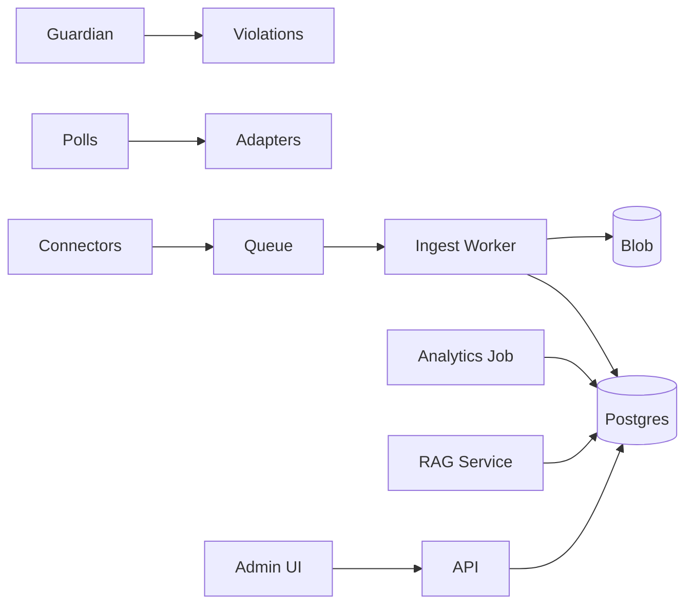

# Technical & Architecture (v2025-09-27)

Stack: **C# .NET 10 (C# 14)**, **GraphQL (Hot Chocolate)** (GraphQL-first), ASP.NET Minimal APIs (only for webhooks/health/internal callbacks), **EF Core + PostgreSQL**, **pgvector** (P2), **Azure Storage Queues/Functions**, **Blob**, **Key Vault**, **App Insights**. Optional **.NET Aspire** for dev orchestration.

## 0. Guiding Principles
- **GraphQL-first API surface**: All client/UI reads & writes (mutations) via GraphQL except external platform webhooks & health probes.
- **Minimal APIs only where GraphQL is unsuitable** (webhooks, health, internal metrics push, liveness/ readiness, Stripe webhooks).
- **In-house lightweight CQRS** (no MediatR) with explicit `ICommand` / `ICommandHandler<T>` and `IQuery<TResult>` / `IQueryHandler<TQuery,TResult>`.
- **Clean Architecture** layering (Domain isolated, no outward infrastructure dependencies).
- **TDD & Fast Feedback**: Write tests before handler implementation; fail fast; keep warning count at 0.
- **Security-by-default**: Input validation, least privilege, PII minimisation, defense in depth.
- **Deterministic builds & reproducible migrations**.

## 1. Minimalist First
- One App Service (or small VM) runs API + Admin; Functions (consumption) handle webhooks/cron; Postgres (small); Blob; Queues; App Insights.
- Nightly analytics jobs; no heavy real‑time ML.

## 2. Grow Later
- Read‑replica Postgres; pgvector; scheduled indexers; optional serverless warehouse for BI; more workers; multi‑region & SSO/SCIM in Phase 3.

## 3. Solution Structure
- **api/** GraphQL endpoint (Hot Chocolate), Minimal API endpoints for: `/health/*`, `/webhooks/*` (Slack/Discord/Telegram/YouTube/Teams/WhatsApp), `/internal/*` (diagnostics). Auth (OIDC), validation, persisted query registration.
- **application/** commands/queries; handlers; policies; validators; transactional pipeline; mapping.
- **domain/** aggregates (Tenant, Workspace, Channel, Thread, Message, Member, Poll, Violation, EvidenceBlob, KnowledgeSource, RagChunk); domain events
- **infrastructure/** EF Core; repositories; migrations; Blob/Queues; Key Vault; HTTP clients
- **workers/** Functions for webhooks (Slack/Discord/Telegram/YouTube/Teams P3); analytics; polls; Guardian; rag-indexer
- **admin-ui/** Blazor Server or React
- **shared/** contracts (MessageEvent etc.)

### 3.1 In-House CQRS Pattern
Interfaces:
```csharp
public interface ICommand { }
public interface ICommandHandler<TCommand> where TCommand : ICommand {
	Task HandleAsync(TCommand command, CancellationToken ct);
}
public interface IQuery<TResult> { }
public interface IQueryHandler<TQuery, TResult> where TQuery : IQuery<TResult> {
	Task<TResult> HandleAsync(TQuery query, CancellationToken ct);
}
```
Pipeline (wrapping handlers): Validation -> Authorization -> Idempotency (commands) -> Transaction -> Handler -> Outbox -> Metrics/Tracing.

### 3.2 GraphQL Layer
- Tooling: Hot Chocolate, GraphQL over HTTP + WebSockets (subscriptions Phase 2 for: Guardian flags, Poll vote tallies, Ingest lag alerts).
- Schema Modules: `Tenant`, `Workspace`, `Channel`, `Poll`, `Guardian`, `AskDB`, `Broadcast`, `Analytics`.
- Mutation -> maps to a Command; Query -> maps to a Query object. Thin resolvers delegate to CQRS handlers.
- **N+1 Mitigation**: DataLoader pattern per aggregate group (batched loads by IDs). Strict field selection mapping.
- **Versioning**: Avoid breaking changes; deprecate fields with `@deprecated` directive; removal after 2 minor releases.
- **Persisted Queries**: Hash-based; only whitelisted operations in production to reduce complexity attack surface.
- **Complexity / Depth Limits**: `maxDepth=10`, complexity scoring (cost weighting for list fields). Reject > threshold with error code `QUERY_COMPLEXITY_EXCEEDED`.

### 3.3 Minimal API Usage
- Webhooks: Verify signatures (Slack signing secret, Discord, Telegram token in path, WhatsApp HMAC, Stripe signature header).
- Health: `/health/live`, `/health/ready`, `/health/deps` (detailed dependency check; hidden behind auth in non-prod).
- Internal callbacks: analytics rollup triggers, embedding batch triggers.

### 3.4 Transactions & Outbox
- Use EF Core `ExecutionStrategy` for transient retry.
- Outbox table for domain events -> background dispatcher (Azure Function) publishes to queue / triggers handlers for side-effects (e.g., indexing, notifications).

### 3.5 Validation & Authorization
- FluentValidation (or simple custom) on Commands/Queries before DB operations.
- Authorization middleware inspects tenant membership + role claims. Field-level auth in GraphQL via directive, e.g., `@requiresRole(role: ADMIN)`.

### 3.6 Error Handling
- Consistent error shape: GraphQL errors with `extensions.code`, `extensions.correlationId`.
- Map domain exceptions (e.g., `NotFound`, `ValidationFailed`, `PermissionDenied`).

### 3.7 Performance & Caching
- Read model queries use projection (SELECT only required fields) and shared compiled queries.
- Introduce Redis (Phase 2) for: DataLoader caching (short TTL), poll live counts, Ask‑DB hot answers, idempotency keys.
- Prepared statements; connection pool target p95 < 50ms acquisition.

### 3.8 Observability Enhancements
- Trace attributes: `tenant.id`, `platform`, `command.name`, `query.name`.
- Metric set: `ingest_lag_seconds`, `queue_depth`, `graphql_query_duration_ms{operation}`, `command_duration_ms{name}`, `guardian_flags_total{type}`.
- Log correlation: pass `Correlation-Id` header through GraphQL context & workers.

### 3.9 Security Additions
- GraphQL depth & complexity enforcement.
- Persisted query required in production (fallback off in controlled feature flag for debugging only).
- Input size caps (e.g., Ask‑DB question length, poll option text length).
- PII scrubbing middleware before log sink.
- Encryption: envelope key (per-tenant) for sensitive columns (phone hash salt, API keys).
- Rate limit (per tenant): commands/sec & queries/sec (token bucket via in-memory + distributed fallback later).

### 3.10 Test Strategy
- **Unit**: Domain entities & handlers (TDD default) — fast, no DB.
- **Integration**: EF Core in-memory or containerized Postgres + GraphQL endpoint tests (schema snapshot + typical flows).
- **Contract**: GraphQL schema snapshot approval; changes require review.
- **Performance Smoke**: Basic load of top queries with threshold budgets in CI (fail if > defined limit regression >20%).
- **Security**: Automated tests for unauthorized field access & complexity limit rejection.

### 3.11 Build & CI Gates
- Build must have **0 warnings** (treat warnings as errors).
- Run: unit -> integration -> contract -> lint/style -> security scan (CodeQL) -> deploy.
- Migration drift check (ensure generated migrations committed).

### 3.12 Migration & Data Evolution
- Additive first; destructive changes require two-step (deprecate -> backfill -> remove next minor version).
- Keep a `schema-history.md` excerpt auto-updated (future automation).

### 3.13 Multi-Tenancy Enforcement
- Global query filters per tenant on DbContext.
- All Commands & Queries require TenantContext injected & asserted.
- Cross-tenant operations prohibited; logs an alert if anomaly detected.

### 3.14 Ask‑DB / RAG Integration (Phase 2)
- Embedding batch job: groups new sources by model & token budget; nightly run with partial batches if below threshold.
- Retrieval path instrumented with spans: `chunk_retrieve`, `rerank`, `compose_answer`.

### 3.15 Guardian Pipeline
- Synchronous pass: regex/rules + lightweight classifier (if toggled) -> Violations queue.
- Feedback loop pushes moderator disposition back into rule tuning store.

### 3.16 Subscriptions (Phase 2+)
- WebSockets for: `pollResultsUpdated`, `guardianFlagCreated`, `ingestHealth`.
- Backpressure: subscription hub rejects > N concurrent per tenant.

### 3.17 Feature Flags
- Config-driven (App Configuration or env) for: RAG, Subscriptions, WhatsApp Beta, PersistedQueryEnforcement override.

### 3.18 Deployment Considerations
- Blue/Green swap with seeded warm-up (run sample GraphQL persisted queries to JIT).
- Database migration job runs separately, verifies checksum, then proceeds with swap.

### 3.19 Operational Runbooks (Pointers)
- `RUNBOOK_ingest_lag.md` (threshold > 120s) -> scale workers + inspect DLQ.
- `RUNBOOK_schema_regression.md` (GraphQL contract test failed) -> review diff, decide deprecation path.

### 3.20 Future (Phase 3) Federation Option
- If splitting domains (e.g., Billing, Analytics) adopt GraphQL federation gateway; keep current monolith schema modular to ease extraction.

## 4. Data Model (selected tables)
- tenants, workspaces, channels, threads, messages, members
- polls, poll_options, poll_responses
- guardian_rules, violations, evidence_blobs
- knowledge_sources, rag_chunks, citations
- metrics_daily, billing_subscriptions, audit_logs

## 5. Connectors — Setup & Monitoring
- **Slack:** create app → scopes (channels:history, app_mentions:read, chat:write) → Events API subscribe → verify URL → monitor delivery (retry headers) → health widget shows last event time/latency.
- **Discord:** create application/bot → enable **Message Content** intent → join servers → gateway connection → shard if needed → health widget shows shard status and event throughput.
- **Telegram:** @BotFather → add to groups → **privacy mode OFF** → set webhook URL → monitor update counts & bot admin status.
- **YouTube Live (opt.):** get liveChatId → `liveChatMessages.streamList` for low‑quota stream → display lag metrics → mirrored Qs to mod console.
- **Microsoft Teams (P3):** AAD registration; admin consent; Graph subscriptions; renewal job; log subscription status.
- **WhatsApp:** Cloud API for 1:1/opt‑ins (announcements); treat groups as out‑of‑scope per policy.

## 6. AI Composition
- **Microsoft.Extensions.AI**: abstractions for chat & embeddings (`IChatClient`, `IEmbeddingGenerator`) to swap providers easily.
- **Semantic Kernel**: optional orchestration/agents for workflows (e.g., moderation + retrieval + channel routing), with memories and planners.
- **RAG**: chunk → embed (pgvector) → retrieve & re‑rank → answer with citations; pointer policy per tenant.

## 7. Observability
- OpenTelemetry traces/metrics; ingestion lag, queue depth, error rate; HealthChecks UI; log redaction filters.

## 8. Resilience & Cost
- Idempotent webhooks; DLQs; retry/backoff; token budgets; batch embeddings at night; cache frequent answers.

## 9. Deployment & CI/CD
- IaC (Bicep/Terraform); GitHub Actions (build/test/SAST/secret scan) → deploy; blue/green; Postgres PITR; blob versioning; runbooks.

## 10. Mermaid Diagram


## 11. References
Additional:
- Hot Chocolate (GraphQL server) docs.
- OWASP GraphQL Security Cheat Sheet.
- EF Core Performance docs (compiled queries, batching).
- Microsoft.Extensions.AI (IChatClient/IEmbeddingGenerator)
- Semantic Kernel (agents/orchestration)
- Slack Events API; Discord privileged intents; Telegram privacy mode; Microsoft Graph channel messages; YouTube Live `streamList`.
