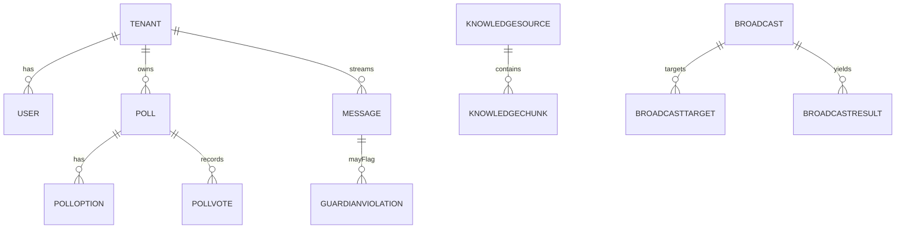

# ER Diagram (Logical)

```mermaid
erDiagram
    TENANT ||--o{ USER : has
    TENANT ||--o{ POLL : owns
    POLL ||--o{ POLLOPTION : has
    POLL ||--o{ POLLVOTE : records
    TENANT ||--o{ MESSAGE : streams
    MESSAGE ||--o{ GUARDIANVIOLATION : mayFlag
    KNOWLEDGESOURCE ||--o{ KNOWLEDGECHUNK : contains
    BROADCAST ||--o{ BROADCASTTARGET : targets
    BROADCAST ||--o{ BROADCASTRESULT : yields
```

---
Navigation: [Home](home.md) | Previous: [State Transitions](state_transitions.md) | Next: [Portal Sitemap](portal_sitemap.md)
