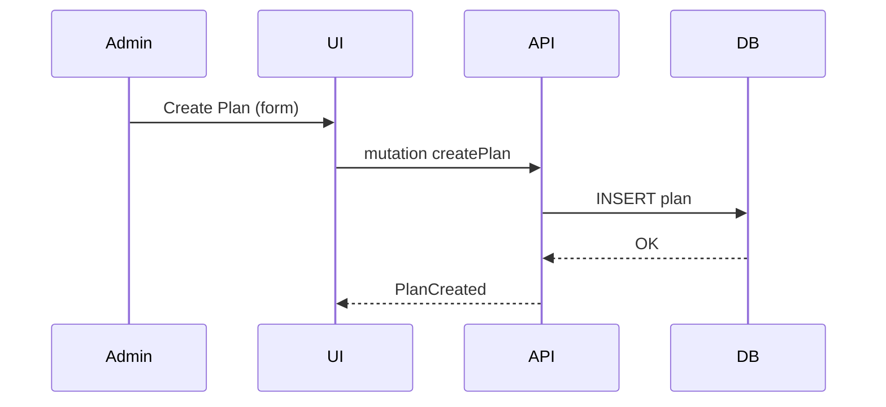

# Global Admin Page: Plans Catalog

| Field | Value |
|-------|-------|
| Spec Version | 0.1.0 |
| Status | Draft |
| Last Updated | 2025-09-28 |
| Owner | Product/Architecture |
| Page ID | PG:GA:02.1 |

## Purpose

Define subscription plans (pricing, limits, feature flags) and lifecycle (create, update, archive) driving billing & entitlement enforcement.

## Context & KPIs

Supports revenue growth, reduces misconfiguration. KPIs: plan adoption mix, MRR per plan, time-to-launch new plan.

## Data Sources

| Source | Type | Fields (Key) | Notes | Class | PII |
|--------|------|--------------|-------|-------|-----|
| GQL:GetPlans | GraphQL | planId, name, priceMonthly, status, features[] | Primary listing | Confidential | N |
| SQLV:vw_plan_mrr | View | plan_id, mrr_current | Aggregated MRR | Confidential | N |

## UI Elements

| UI ID | Type | Data | Shape | Class | PII | Notes |
|-------|------|------|-------|-------|-----|-------|
| UI:GA:02.1:01 | Table Plans | GQL:GetPlans | [{planId,name,price,status}] | Confidential | N | Sortable |
| UI:GA:02.1:02 | Create Button | N/A | {} | Internal | N | Opens modal |
| UI:GA:02.1:03 | Plan Detail Drawer | Aggregated | {plan,limits,features} | Confidential | N | Lazy load |

## Actions & Events

| Action ID | Action | Event | Workflow | Notes |
|-----------|--------|-------|----------|-------|
| ACT:GA:02.1:01 | Create Plan | EVT:plan.created | WF:plan-create | Validates uniqueness |
| ACT:GA:02.1:02 | Update Plan | EVT:plan.updated | WF:plan-update | Price change versioning |
| ACT:GA:02.1:03 | Archive Plan | EVT:plan.archived | WF:plan-archive | Soft archive only |

## Domain Aggregates

| Aggregate | Fields (Key) | Invariants |
|-----------|--------------|-----------|
| Plan | planId, name, status, priceMonthly | status ∈ {active,archived} |

## Metrics

| Metric ID | Definition |
|-----------|------------|
| MET:fin:mrr | Sum active subscription MRR |

## Workflow Diagram

## Validation / Rules

| Rule | Enforcement |
|------|------------|
| Name unique | Server |
| Cannot archive plan with active subscriptions | Server |

## Test Hooks

| Test ID | Description |
|---------|-------------|
| TEST:ga.plan.lifecycle | Create → update → archive |

## Change Impact

Impacts billing proration, entitlement checks, revenue metrics.

---
Navigation: [Global Admin Portal Sitemap](portal_global_admin_sitemap.md) | Next: [Invoices](ga_pg_02_2_invoices.md)
