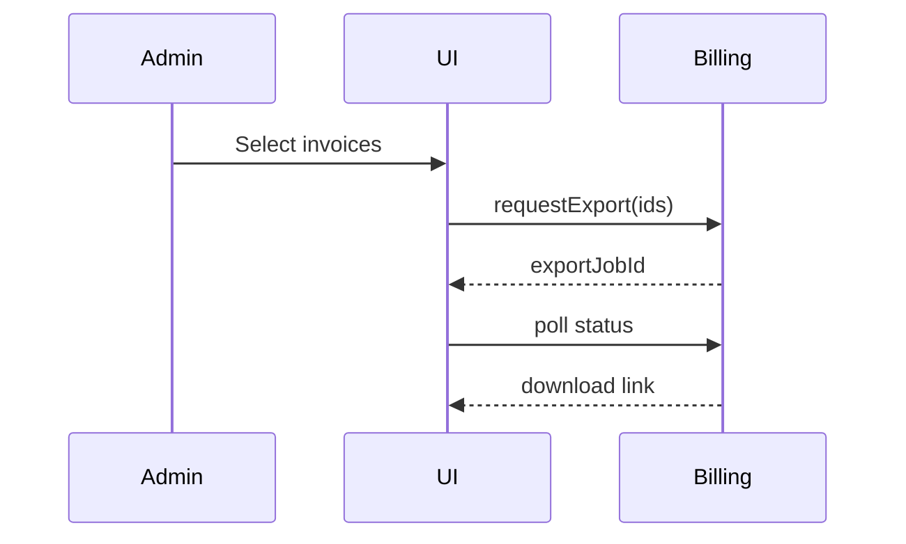

# Global Admin Page: Invoices

| Field | Value |
|-------|-------|
| Spec Version | 0.1.0 |
| Status | Draft |
| Last Updated | 2025-09-28 |
| Owner | Finance Ops |
| Page ID | PG:GA:02.2 |

## Purpose

List and export tenant invoices for auditing & finance reconciliation.

## Data Sources

| Source | Type | Fields | Notes | Class | PII |
|--------|------|--------|-------|-------|-----|
| GQL:GetInvoices | GraphQL | invoiceId, tenantId, total, status, period | Paginated | Confidential | N |
| SQLV:vw_invoice_totals | View | invoice_id, line_count | Precomputed lines | Confidential | N |

## UI Elements

| UI ID | Type | Data | Shape | Class | PII | Notes |
|-------|------|------|-------|-------|-----|-------|
| UI:GA:02.2:01 | Table Invoices | GQL:GetInvoices | [{invoiceId,tenantId,total,status,period}] | Confidential | N | Filterable |
| UI:GA:02.2:02 | Export Button | Selection | {invoiceIds[]} | Internal | N | Batch export |

## Actions & Events

| Action ID | Action | Event | Workflow |
|-----------|--------|-------|----------|
| ACT:GA:02.2:01 | Export Invoices | EVT:invoice.export.created | WF:invoice-export |

## Workflow Diagram

---
Navigation: [Plans Catalog](ga_pg_02_1_plans_catalog.md) | Next: [Usage Overview](ga_pg_04_1_usage_overview.md)
