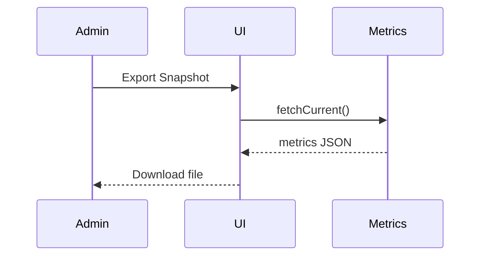

# Global Admin Page: Health Dashboard

| Field | Value |
|-------|-------|
| Spec Version | 0.1.0 |
| Status | Draft |
| Last Updated | 2025-09-28 |
| Owner | SRE |
| Page ID | PG:GA:05.1 |

## Purpose

Surface platform operational KPIs (latency, queue depth, error rates) and allow export of snapshot.

## Data Sources

| Source | Type | Fields | Class | PII | Notes |
|--------|------|--------|-------|-----|-------|
| MetricsService:getOps | Service | ingest_latency_p95, queue_depth, error_rate | Internal | N | Cached 30s |

## UI Elements

| UI ID | Type | Data | Shape | Class | PII | Notes |
|-------|------|------|-------|-------|-----|-------|
| UI:GA:05.1:01 | KPI Tiles | metrics | [{metric,value,trend}] | Internal | N | Trend sparkline |
| UI:GA:05.1:02 | Queue Chart | metrics | timeSeries | Internal | N | 24h window |

## Actions & Events

| Action ID | Action | Event | Workflow |
|-----------|--------|-------|----------|
| ACT:GA:05.1:01 | Export Snapshot | EVT:health.snapshot.exported | WF:health-export |

## Workflow Diagram

---
Navigation: [Usage Overview](ga_pg_04_1_usage_overview.md) | Next: [Compliance Overview](ga_pg_06_1_compliance_overview.md)
