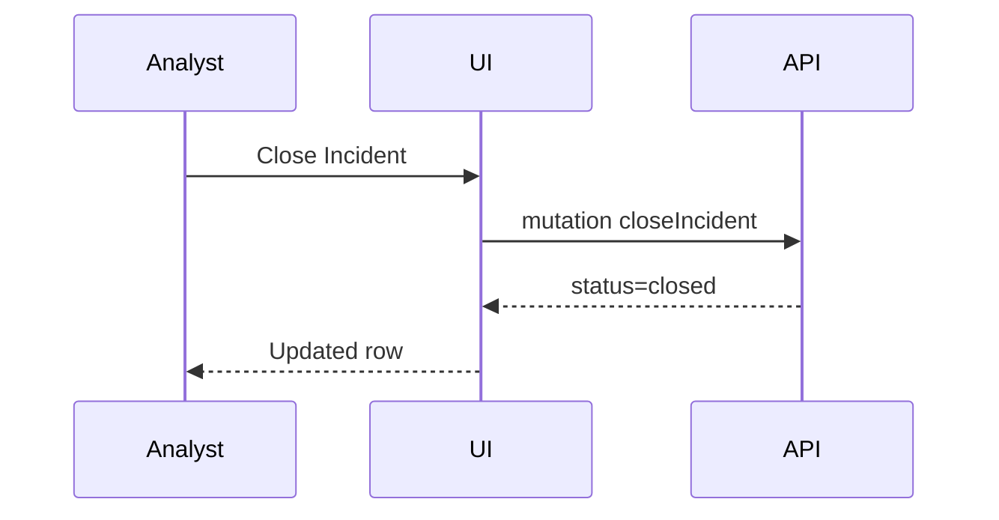

# Global Admin Page: Incidents

| Field | Value |
|-------|-------|
| Spec Version | 0.1.0 |
| Status | Draft |
| Last Updated | 2025-09-28 |
| Owner | SRE |
| Page ID | PG:GA:10.1 |

## Purpose

Track open/closed incidents, SLA timers, remediation actions.

## Data Sources

| Source | Type | Fields | Class | PII | Notes |
|--------|------|--------|-------|-----|-------|
| GQL:GetIncidents | GraphQL | incidentId, severity, status, openedAt, closedAt | Internal | N | Paginated |

## UI Elements

| UI ID | Type | Data | Shape | Class | PII | Notes |
|-------|------|------|-------|-------|-----|-------|
| UI:GA:10.1:01 | Incidents Table | incidents | [{incidentId,severity,status,age}] | Internal | N | Color-coded severity |
| UI:GA:10.1:02 | Detail Drawer | row | {timeline,actions[]} | Internal | N | Poll updates |

## Actions & Events

| Action ID | Action | Event | Workflow |
|-----------|--------|-------|----------|
| ACT:GA:10.1:01 | Close Incident | EVT:incident.closed | WF:incident-close |
| ACT:GA:10.1:02 | Add Timeline Entry | EVT:incident.timeline.added | WF:incident-update |

## Workflow Diagram

---
Navigation: [Internal Users](ga_pg_09_1_internal_users.md) | Next: [Global Settings](ga_pg_11_1_global_settings.md)
