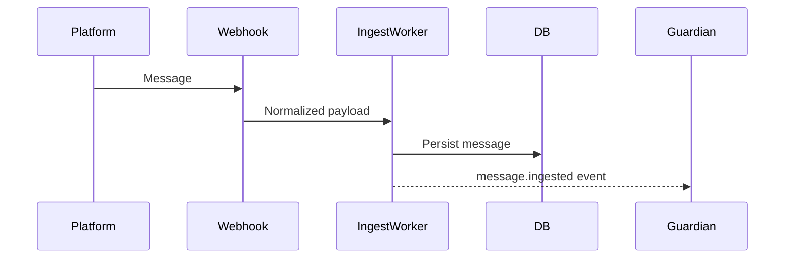

# Sequence Diagrams (Key Flows)

Additional flows: poll vote, guardian flag, Ask‑DB answer, broadcast dispatch.

---
Navigation: [Home](home.md) | Previous: [Architecture Overview](architecture_overview.md) | Next: [Class & Aggregate Diagrams](class_aggregate_diagrams.md)
