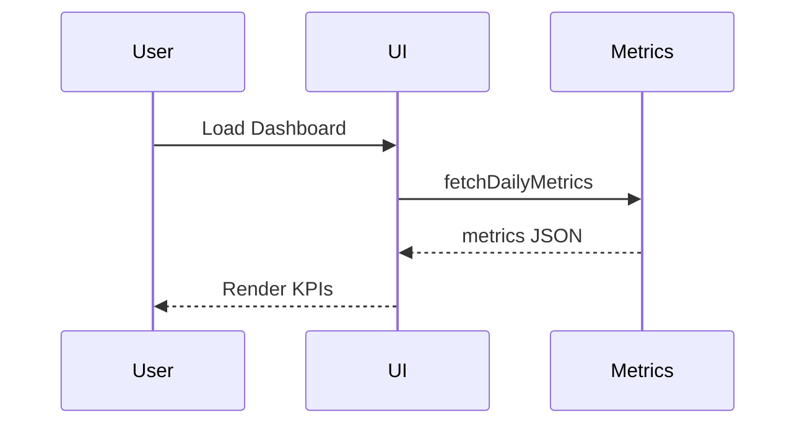

# Tenant Workspace Page: Dashboard

| Field | Value |
|-------|-------|
| Spec Version | 0.1.0 |
| Status | Draft |
| Last Updated | 2025-09-28 |
| Owner | Product |
| Page ID | PG:TW:01.1 |

## Purpose

Snapshot of engagement, safety, broadcast reach, recent activity.

## Data Sources

| Source | Type | Fields | Class | PII | Notes |
|--------|------|--------|-------|-----|-------|
| Metrics:getTenantDaily | Service | messages_7d, polls_7d, violations_7d | Confidential | N | Aggregated |
| GQL:GetRecentActivity | GraphQL | events{type,ts,actorHash} | Confidential | Y | actor hashed |

## UI Elements

| UI ID | Type | Data | Shape | Class | PII | Notes |
|-------|------|------|-------|-------|-----|-------|
| UI:TW:01.1:01 | KPI Tiles | metrics | [{metric,value,trend}] | Confidential | N | Trend lines |
| UI:TW:01.1:02 | Recent Activity Feed | activity | [{type,ts,actor}] | Confidential | Y | Hash masked |

## Workflow Diagram

---
Navigation: [Tenant Workspace Portal Sitemap](portal_tenant_workspace_sitemap.md) | Next: [Poll Analytics](tw_pg_02_3_poll_analytics.md)
