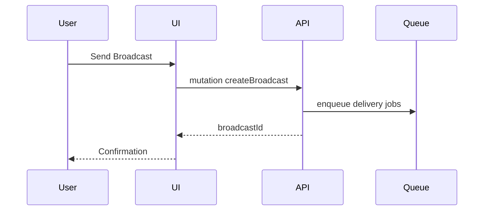

# Tenant Workspace Page: Broadcast Composer

| Field | Value |
|-------|-------|
| Spec Version | 0.1.0 |
| Status | Draft |
| Last Updated | 2025-09-28 |
| Owner | Messaging Team |
| Page ID | PG:TW:06.1 |

## Purpose

Compose outbound multi-platform broadcast message.

## Data Sources

| Source | Type | Fields | Class | PII | Notes |
|--------|------|--------|-------|-----|-------|
| GQL:GetBroadcastPlatforms | GraphQL | platform, enabled | Confidential | N | Per tenant |

## UI Elements

| UI ID | Type | Data | Shape | Class | PII | Notes |
|-------|------|------|-------|-------|-----|-------|
| UI:TW:06.1:01 | Message Editor | form | {text} | Confidential | N | 2k char limit |
| UI:TW:06.1:02 | Platform Selector | platforms | [{platform,enabled}] | Confidential | N | Multi-select |
| UI:TW:06.1:03 | Send Button | form state | {disabled} | Internal | N | Validates length |

## Actions & Events

| Action ID | Action | Event | Workflow |
|-----------|--------|-------|----------|
| ACT:TW:06.1:01 | Send Broadcast | EVT:broadcast.created | WF:broadcast-send |

## Workflow Diagram

---
Navigation: [Ask Sources](tw_pg_05_2_ask_sources.md) | Next: [Broadcast History](tw_pg_06_2_broadcast_history.md)
