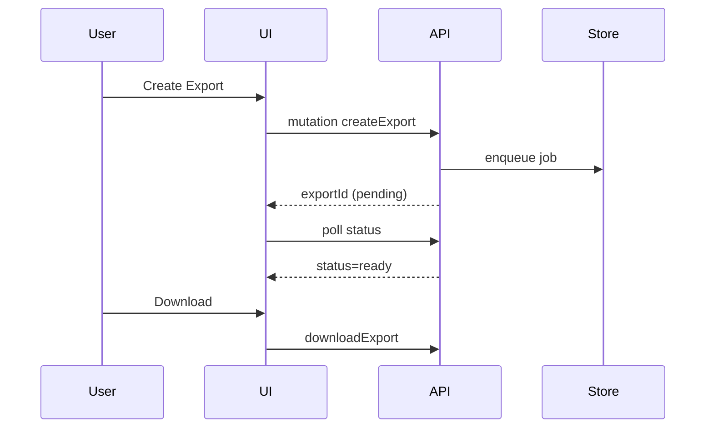

# Tenant Workspace Page: Data Exports

| Field | Value |
|-------|-------|
| Spec Version | 0.1.0 |
| Status | Draft |
| Last Updated | 2025-09-28 |
| Owner | Data Ops |
| Page ID | PG:TW:12.1 |

## Purpose

Configure and download raw data export jobs (poll votes, messages, violations).

## Data Sources

| Source | Type | Fields | Class | PII | Notes |
|--------|------|--------|-------|-----|-------|
| GQL:GetExports | GraphQL | exportId, type, status, createdAt | Confidential | N | Paginated |

## UI Elements

| UI ID | Type | Data | Shape | Class | PII | Notes |
|-------|------|------|-------|-------|-----|-------|
| UI:TW:12.1:01 | Exports Table | exports | [{exportId,type,status,createdAt}] | Confidential | N | Status badges |
| UI:TW:12.1:02 | New Export Button | N/A | {} | Internal | N | Opens wizard |

## Actions & Events

| Action ID | Action | Event | Workflow |
|-----------|--------|-------|----------|
| ACT:TW:12.1:01 | Create Export | EVT:export.requested | WF:export-create |
| ACT:TW:12.1:02 | Download Export | EVT:export.downloaded | WF:export-download |

## Workflow Diagram

---
Navigation: [Audit Logs](tw_pg_11_1_audit_logs.md) | Back: [Tenant Workspace Portal Sitemap](portal_tenant_workspace_sitemap.md)
